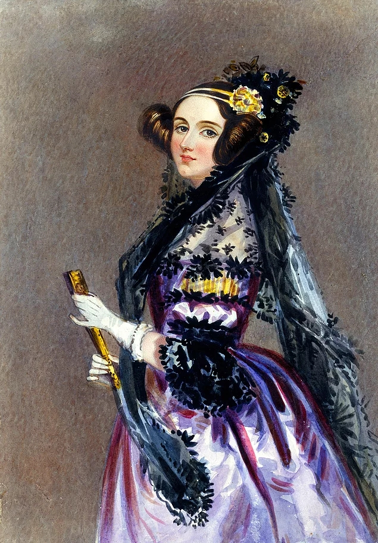

 <h1 align="center">C ve C++  ile İlgili Çalışmalar</h1>
<h1 align="center">Slaytlar-Veri Yapıları-Problem Çözümleri-Projeler</h1>

2019-20 yıllarında hazırlamış olduğum c ve c++ ile ilgili çeşitli çalışmalar burada yer almaktadır. 

Bu dökümanlar  çeşitli seviyelerdeki üniversite öğrencilerinin ilgili derslerine yardımcı olması amacı ile hazırlanmıştır. Başlangıç seviyesi kaynaklar taranmış orta ve ileri seviyeye de hitap edebilecek formatta sunumlar hazırlanarak örnek çözümler konulmuştur.

Özellikle pandemi döneminde online ve yüz yüze farklı öğrencilerle paylaşılmıştır. İçerikler sunulmuş, hazırlanan problemler çözülmüştür. Öğrencilerden gelen proje tadında  çalışmalar da konularak ileri seviye uygulamalar yapılmıştır.

İlgilenen herkes için başvuru niteliğinde olması amaçlanmıştır. Konulan örneklerin büyük çoğunluğu çalıştırılmıştır. Proje çalışması seviyesinde örnekler ve çözümler de mevcuttur. Projelerin çalıştırılması için gererli tüm dosyalar da klasörlerin içeriğine konulmuştur.

Umarım ilgilenenlere faydalı olur...

## İletişim

- GitHub [@your-ilyas9461](https://github.com/ilyas9461)
- Linkedin [@your-linkedin](https://www.linkedin.com/in/ilyas-yagcioglu/)
